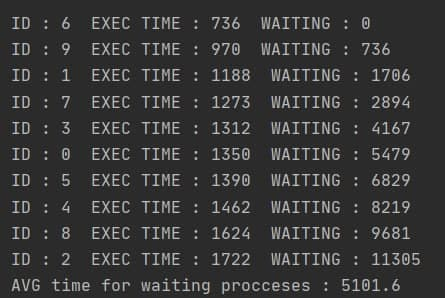
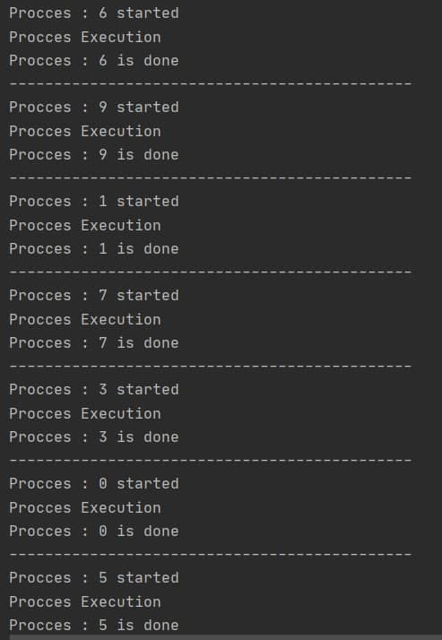

# Procces Manager Shortest Job First (SJF)
This is a Java implementation of **Process Manager Simulator**.  
**SJF - Shortest Job First** One of the methods of solving the "convoy effect" is
a strategy that allows the queue to be executed first.
Shortest job first (SJF), also known as shortest job next (SJN) , is a scheduling policy that selects for execution the waiting process with the smallest execution time.The harder the process, the longer it will not be performed, and vice versa
.SJF is advantageous because of its simplicity and because it minimizes the average amount of time each process has to wait until its execution is complete.
Now i will describe the structure of the **Process**

## Process
 Every procces contain : 
 - process_id
 - execution_time - determine the time of execution(in milliseconds)
 - wait_time - determine the time of waiting from the beginning.
 
Also i override the methods `equals` and `hashCode` for the futher usage of this class. 
 
## Methods descriptions       

`public void addProcessToSceduler(Process process)` - put process into the queue according to the algorithm.  
`public void generateListOfProcceses(int countOfProcceses)` - generate processes by the number in the argument.  
`public void updateTimeWaiting(int indexOfBegin)` - update time waiting for the processes every time when we added new one to the queue.
`avgTimeOfWaitingPerProcces()` - calculate the average time of waiting for every procces.

## Usage
Firstly i will create the instance of the Scheduler
`Scheduler sceduler = new Scheduler(10);`
Now i will print out the queue of the processes

Process flow  

And the piece of log 

   

 